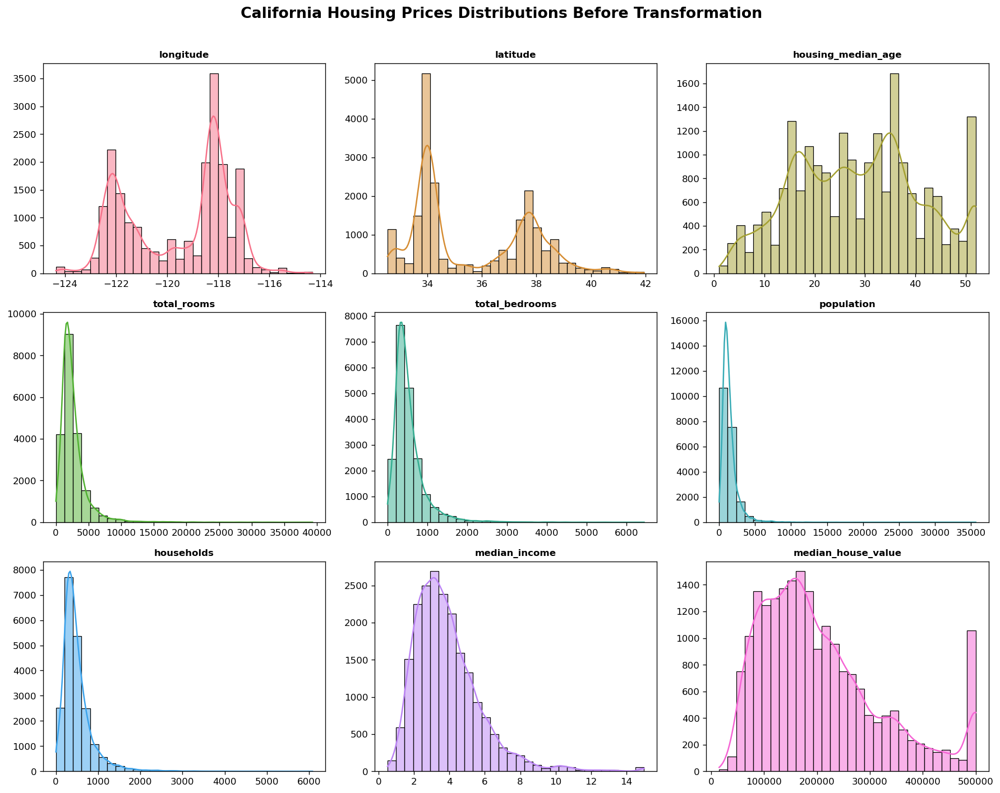
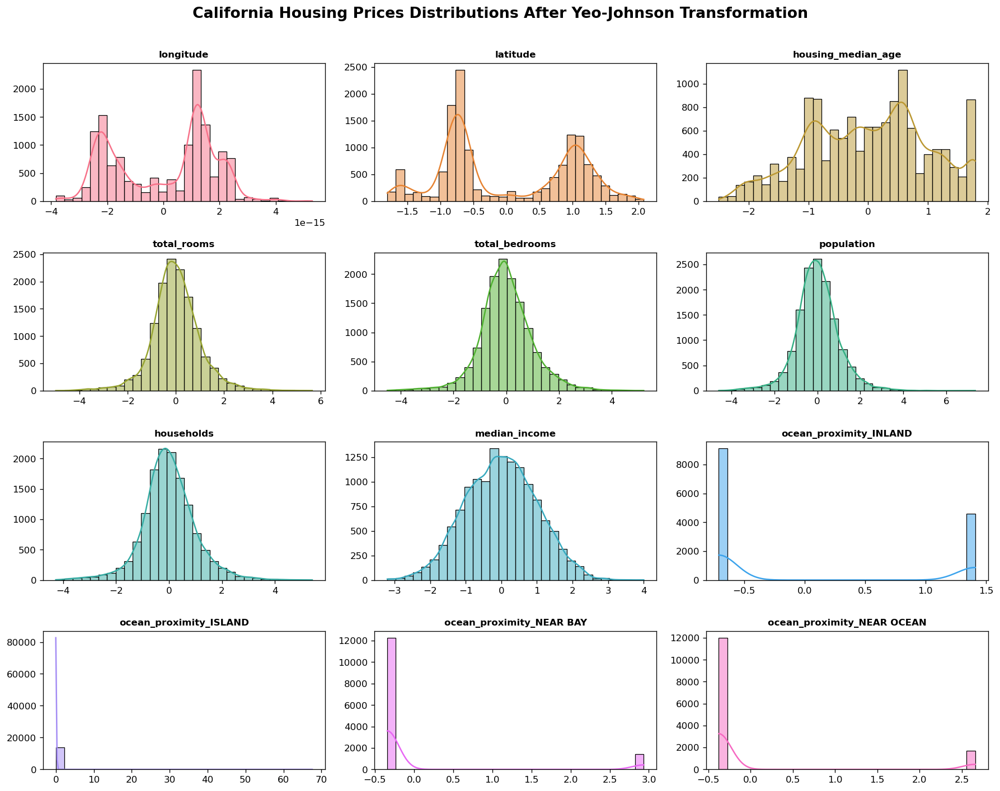
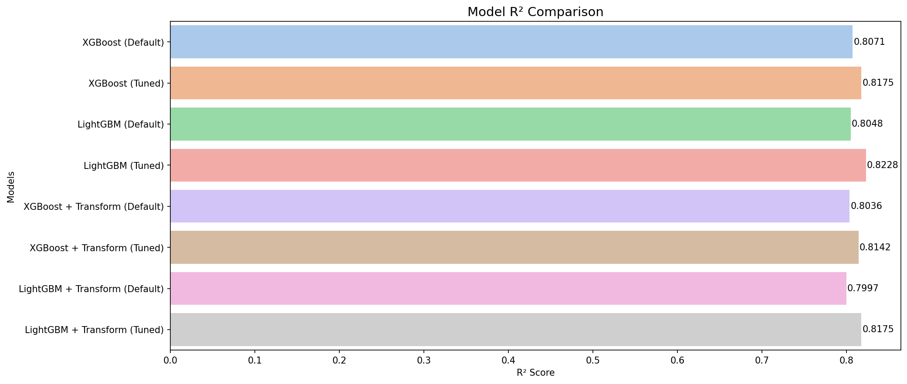

# 🏡 California Housing Price Prediction — XGBoost vs LightGBM

> 📘 **Description:**  
> Comparison of XGBoost and LightGBM model performance **before and after applying Box-Cox & Yeo-Johnson transformations**,  
> using the [California Housing Prices](https://www.kaggle.com/datasets/camnugent/california-housing-prices) dataset.

---

## 🧾 TL;DR

- **Goal:** Predict median house values based on demographic and geographical features  
- **Dataset:** [California Housing Prices](https://www.kaggle.com/datasets/camnugent/california-housing-prices)  
- **Models:** XGBoost, LightGBM (default & tuned)  
- **Transformations:** Box-Cox & Yeo-Johnson  
- **Best R²:** 0.8228 (LightGBM with hyperparameters, no transformation)

---

## 📊 Dataset Information

**Target variable:** `median_house_value`

**Features:**  
`['longitude', 'latitude', 'housing_median_age', 'total_rooms', 'total_bedrooms', 'population', 'households', 'median_income', 'median_house_value', 'ocean_proximity']`

**Dataset size:** ~20,000 samples  
**Source:** [Kaggle - California Housing Prices](https://www.kaggle.com/datasets/camnugent/california-housing-prices)

---

## 📈 Feature Distributions

Below are the **feature distributions** of the California Housing dataset,  
before and after applying the **Box-Cox** and **Yeo-Johnson** transformations.

### 🟩 Before Transformation


### 🟦 After Transformation


📉 *Observation:*  
Most features (like `total_rooms`, `population`, and `median_house_value`) were right-skewed.  
After applying transformations, their distributions became more symmetric and closer to normal.

---

## ⚙️ Model 1: Without Transformation

| Model | MAE | MSE | RMSE | R² |
|-------|------|------|------|------|
| XGBoost (Default) | 28663.59 | 1.78×10⁹ | 42221.55 | 0.8071 |
| XGBoost (Tuned) | 27896.12 | 1.69×10⁹ | 41076.44 | 0.8175 |
| LightGBM (Default) | 29221.30 | 1.80×10⁹ | 42480.51 | 0.8048 |
| LightGBM (Tuned) | **27291.08** | **1.64×10⁹** | **40465.69** | **0.8228** |

📈 *Best performer:* **LightGBM with hyperparameter tuning**  
💡 *Insight:* Hyperparameter tuning clearly improved both models, especially LightGBM.

---

## ⚙️ Model 2: After Box-Cox & Yeo-Johnson Transformation

| Model | MAE | MSE | RMSE | R² |
|-------|------|------|------|------|
| XGBoost (Default) | 28214.20 | 1.81×10⁹ | 42602.63 | 0.8036 |
| XGBoost (Tuned) | 27416.49 | 1.72×10⁹ | 41437.39 | 0.8142 |
| LightGBM (Default) | 28943.76 | 1.85×10⁹ | 43032.55 | 0.7997 |
| LightGBM (Tuned) | **27214.95** | **1.69×10⁹** | **41072.79** | **0.8175** |

📈 *Observation:*  
Data transformations (Box-Cox, Yeo-Johnson) **did not significantly improve** performance on tree-based models like XGBoost and LightGBM —  
these algorithms already handle non-normal feature distributions quite well.

---

## 🧠 Insights

- Tree-based models are robust to skewed feature distributions, so transformations like Box-Cox or Yeo-Johnson had **minor impact**.  
- **LightGBM** slightly outperformed **XGBoost** across all settings.  
- The strongest predictor was **`median_income`**, aligning with real-world housing trends.  
- Model tuning had a **larger effect** on performance than transformations.

---

## 📊 R² Score Comparison

The following chart shows the **R² performance** of all models before and after applying data transformations.



📈 *Insight:*  
LightGBM with hyperparameter tuning achieved the **best overall R² (0.8228)**,  
while transformations like Box-Cox and Yeo-Johnson produced only minimal improvements.

---

## 🧩 Used Libraries

```python
pandas, numpy, seaborn, matplotlib  
scikit-learn, xgboost, lightgbm, scipy
